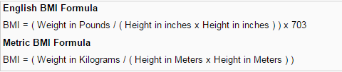
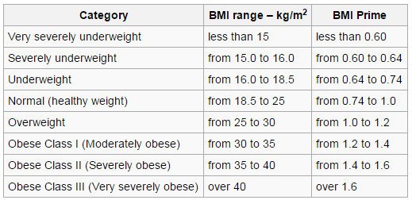

## What iS BMI ?

Body mass index (BMI) is a measure of body fat based on height and weight that applies to adult men and women. Enter your weight and height using standard or metric measures. Select "Compute BMI" and your BMI will appear below.

--- .class #id 

## BMI Formula 


<div style='text-align: center;'>
    
</div>

--- .class #id 

## BMI Categories


<div style='text-align: center;'>
    
</div>

--- .class #id 

## Calculation in R

Formula to get BMI Index

```{r, echo=TRUE}
calculateBmi <- function(weight, height) as.numeric(weight / (height*height))  
```

Formula to get BMI Category

```{r, echo=TRUE}
calculateCategory <- function(bmi) 
{
  bmi <- as.numeric(bmi)
  category <- ifelse((bmi<15),'Very severely underweight',ifelse(bmi>=15 & bmi<16,'Severely underweight',ifelse(bmi>=16 & bmi<18.5,'Underweight',ifelse(bmi>=18.5 & bmi<25,'Normal (healthy weight)',ifelse(bmi>=25 & bmi<30,'Overweight',ifelse(bmi>=30 & bmi<35,'Obese Class I (Moderately obese)',ifelse(bmi>=35 & bmi<40,'Obese Class II (Severely obese)',ifelse(bmi>=40,'Obese Class III (Very severely obese)',''))))))))
  return(category)
}
```

--- .class #id 

## Get The Trend In Indonesia In Current Month

Obtain data 

```{r, echo=TRUE}
term <- format(Sys.Date(), format="%Y%m")    
url <- paste('http://stats.grok.se/json/id',term,'obesitas',sep="/")        
rawData <- getURL(url)    
parsedData <- fromJSON(rawData)    
viewsData <- data.frame(Date=names(parsedData$daily_views),Views=parsedData$daily_views, row.names=NULL)    
```

--- .class #id 

## The Plot

And last thing, plot it

```{r, echo=TRUE}
ggplot(viewsData, aes(x=Date, y=Views,group="l")) + geom_point() +  geom_line() + ggtitle('Wikipedia article traffic statistics for "Obesitas"') + xlab("Date") + ylab("#Views") + theme(axis.text.x = element_text(angle = 90, hjust = 1))
```